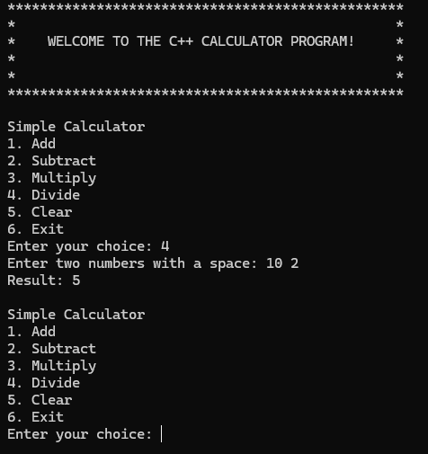

# Simple C++ Calculator

## Description

This is a simple calculator program written in C++ that allows users to perform basic arithmetic operations. It supports addition, subtraction, multiplication, and division. Additionally, users can clear the console screen and exit the program at any time.

The program uses a `do-while` loop to keep asking for input, a `switch-case` statement for operation selection, and an `if-else` block to handle edge cases like division by zero. It also includes a clear screen feature for a better user experience.

## Features
- Addition, Subtraction, Multiplication, and Division
- Clear Console screen
- Exit option to close the program
- User-friendly interface with instructions

## Screenshot

Here is a screenshot of the calculator in action:



## How to Run
1. Clone this repository or download the source code files.
2. Use a C++ compiler to compile the files:
   ```bash
   g++ main.cpp calculator.cpp -o calculator
